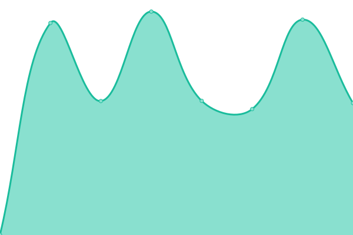
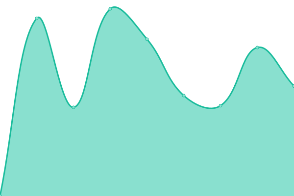

# [📈 Live Status](https://EB1TR.github.io/upptime): <!--live status--> **🟩 All systems operational**

This repository contains the open-source uptime monitor and status page for [Fabian](https://www.eb1tr.com), powered by [Upptime](https://github.com/upptime/upptime).

With [Upptime](https://upptime.js.org), you can get your own unlimited and free uptime monitor and status page, powered entirely by a GitHub repository. We use [Issues](https://github.com/EB1TR/upptime/issues) as incident reports, [Actions](https://github.com/EB1TR/upptime/actions) as uptime monitors, and [Pages](https://EB1TR.github.io/upptime) for the status page.

<!--start: status pages-->
<!-- This summary is generated by Upptime (https://github.com/upptime/upptime) -->
<!-- Do not edit this manually, your changes will be overwritten -->
<!-- prettier-ignore -->
| URL | Status | History | Response Time | Uptime |
| --- | ------ | ------- | ------------- | ------ |
|  [EB1TR](https://www.eb1tr.com) | 🟩 Up | [eb-1-tr.yml](https://github.com/EB1TR/upptime/commits/HEAD/history/eb-1-tr.yml) | 

 1148ms
     
 | 

<a href="https://EB1TR.github.io/upptime/history/eb-1-tr">100.00%</a>
    

|  [RadioMercado](https://www.radiomercado.es) | 🟩 Up | [radio-mercado.yml](https://github.com/EB1TR/upptime/commits/HEAD/history/radio-mercado.yml) | 

 828ms
     
 | 

<a href="https://EB1TR.github.io/upptime/history/radio-mercado">100.00%</a>
    

|  [EA1URA](https://www.ea1ura.com) | 🟩 Up | [ea-1-ura.yml](https://github.com/EB1TR/upptime/commits/HEAD/history/ea-1-ura.yml) | 

 899ms
     
 | 

<a href="https://EB1TR.github.io/upptime/history/ea-1-ura">100.00%</a>
    

<!--end: status pages-->

[**Visit our status website →**](https://EB1TR.github.io/upptime)

## 📄 License

- Powered by: [Upptime](https://github.com/upptime/upptime)
- Code: [MIT](./LICENSE) © [Fabian](https://www.eb1tr.com)
- Data in the `./history` directory: [Open Database License](https://opendatacommons.org/licenses/odbl/1-0/)
